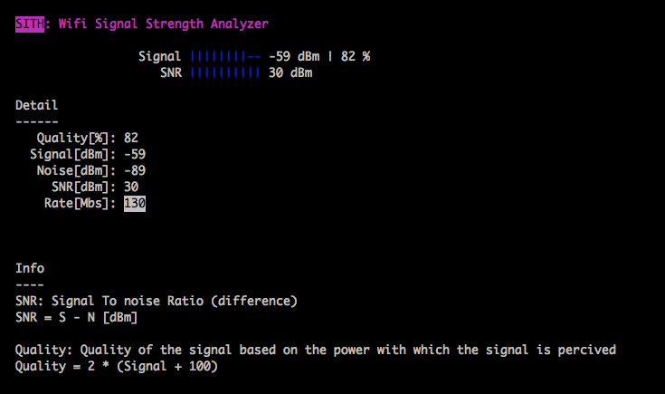

<h1 align="center">
  
  </br>
  </br>  
  SITH
</h1>

> SITH is a Wifi Signal Strength Analyzer CLI app and API

Wrap OS specific commands and provide a unified way of displaying Wifi Signal data.

Use it as a diagnostic tool for your network.

  

## Intro

```sh
# Install
npm install -g sith

# Run it!
sith
```


Or use the API

```javascript

import sith from 'sith';


sith() // => {signal, noise, snr, rate, quality}
```


## Known limitations
Right now SITH will have an undefined behavior if more than one Wifi card
is enabled/transmiting. Potentially this is something we are going to be fixing in the future.

SITH does not support Windows for now!


